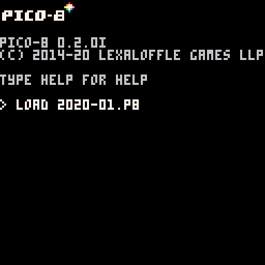

# Roguelikedev does the Complete Roguelike Tutorial

***

## Now With More PICO-8 [^1]

This is my attempt at working through the 2020 `/r/roguelikedev` summer programming project. The goal is to follow along with the `python`/`libtcod` [tutorial](http://rogueliketutorials.com/tutorials/tcod/part-0/) but PICO-8-ify everything.

***

## Progress Log

### Week 1

- Printing `@`
- Can move it around the screen

***

[^1]: Hopefully, I'll make it all the way to the end.
